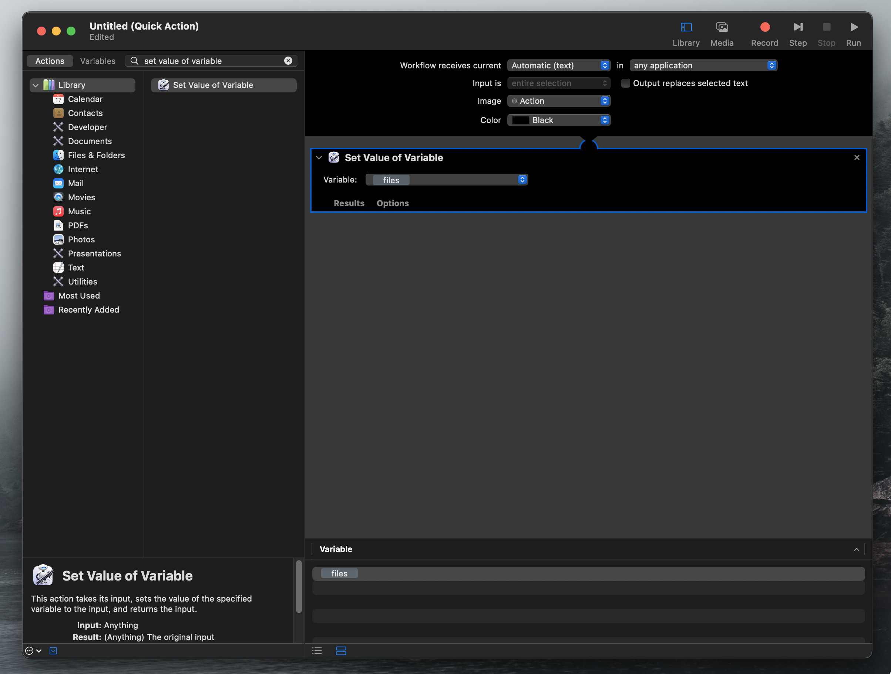
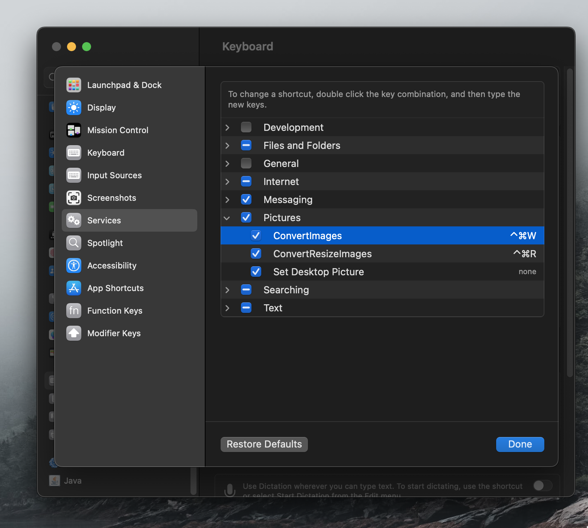

# webp-automation

macOS automation to quickly resize images and convert to webp

### [Watch the Tutorial](https://youtu.be/wwmGBhFeHVU)

### [Blog Post](https://cedarstudioswebdesign.com/blog/optimize-images-for-website-design/)

## Requirements

- macOS with Automator

- node

        `brew install node`

- sharp image processor

        `npm i sharp -g`

## Usage

Simply select any image file(s) and launch with a custom keyboard shortcut or through the Quick Actions menu:

### convert-images

This is the simplest automation. With a single keyboard shortcut (we use `⌘ + ^ + W`), all selected images will be converted to the `.webp` format and stored alongside the original image.

### convert-resize-images

This automation will optionally resize the image. There are three use cases:

1. If no width is entered, the automation falls back to `convert-images` and converts but does not resize the images.

2. If a width—but not a height—is entered, the image is resized to the selected width. The height is automatically calculated based on the aspect ratio of the original image.

In the gif at the top of this page, the height is not entered and the dimensions of the image scale from 6000x4000 to 2000x1333.

3. If a width _and_ a height are entered, the image is scaled according to the [object-fit: cover](https://developer.mozilla.org/en-US/docs/Web/CSS/object-fit) directive in CSS.

## Installation

See our [tutorial video]().

### convert-images

1. Install node and sharp on your machine

   `brew install node`

   `npm i sharp -g`

2. Open Automator and make a new Quick Action

3. Change the `Workflow receives current` properties to `images files` and `Finder`.

4. Add a `Set Value of Variable` step. Create a new variable and name it "files".

5. Add a `Run AppleScript` step. Paste in the contents of `convert-images/convert-images.scpt`.

6. Name and save your Automation (e.g., "ConvertImages")

7. Place the `convert-images/convert-images.js` file in your `/Users/<name>/` folder.

**Your automation should now appear in the Quick Actions menu!**

8. [Optional]: Map this to a keyboard shortcut by going to `System Settings > Keyboard > Keyboard Shortcuts > Services` and giving it a unique keyboard shortcut.

**Now you can convert images simply by selecting them and clicking `⌘ + ^ + W` !**

### convert-resize-images

Repeat the above steps with these changes:

5. Add a `Run AppleScript` step. Paste in the contents of `convert-resize-images/convert-resize-images.scpt`.

6. Name and save your Automation (e.g., "ConvertResizeImages")

7. Place the `convert-images/convert-resize-images.js` file in your `/Users/<name>/` folder.

I use a keyboard shortcut of `⌘ + ^ + R` for this automation.
